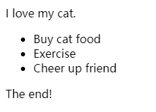

# 介绍css布局
在这个模块中将涉及更多关于页面布局技术的细节：  
- 正常布局流
- display属性
- 弹性盒子
- 网格
- 浮动
- 定位
- CSS 表格布局
- 多列布局  
## 正常布局流(Normal flow)  
正常布局流(normal flow)是指在不对页面进行任何布局控制时，浏览器默认的HTML布局方式。让我们快速地看一个HTML的例子：  
```html
<p>I love my cat.</p>

<ul>
  <li>Buy cat food</li>
  <li>Exercise</li>
  <li>Cheer up friend</li>
</ul>

<p>The end!</p>
```
  
出现在另一个元素下面的元素被描述为**块元素**，与出现在另一个元素旁边的**内联元素**不同，内联元素就像段落中的单个单词一样。  
下列布局技术会覆盖默认的布局行为：  
- display 属性 — 标准的value,比如block, inline 或者 inline-block 元素在正常布局流中的表现形式 (见 Types of CSS boxes). 接着是全新的布局方式，通过设置display的值, 比如 CSS Grid 和 Flexbox.
- 浮动——应用 float 值，诸如 left 能够让块级元素互相并排成一行，而不是一个堆叠在另一个上面。
- position 属性 — 允许你精准设置盒子中的盒子的位置，正常布局流中，默认为 static ，使用其它值会引起元素不同的布局方式，例如将元素固定到浏览器视口的左上角。
- 表格布局— 表格的布局方式可以用在非表格内容上，可以使用display: table和相关属性在非表元素上使用。
- 多列布局— 这个 Multi-column layout 属性 可以让块按列布局，比如报纸的内容就是一列一列排布的。  
## display属性  
在css中实现页面布局的主要方法是设定display属性的值。此属性允许我们更改默认的显示方式。正常流中的所有内容都有一个display的值，用作元素的默认行为方式。例如，英文段落显示在一个段落的下面，这是因为它们的样式是display:block。如果在段落中的某个文本周围创建链接，则该链接将与文本的其余部分保持内联，并且不会打断到新行。这是因为&lt;a>元素默认为display:inline。  
## 弹性盒子(Flexbox)  
Flexbox 是CSS 弹性盒子布局模块（Flexible Box Layout Module）的缩写，它被专门设计出来用于创建横向或是纵向的一维页面布局。要使用flexbox，你只需要在想要进行flex布局的父元素上应用display: flex ，所有直接子元素都将会按照flex进行布局。  
## Grid布局  
Flexbox用于设计横向或纵向的布局，而Grid布局则被设计用于同时在两个维度上把元素按行和列排列整齐。 同flex一样，你可以通过指定display的值来转到grid布局：display: grid。  
## 浮动  
把一个元素“浮动”(float)起来，会改变该元素本身和在正常布局流（normal flow）中跟随它的其他元素的行为。这一元素会浮动到左侧或右侧，并且从正常布局流(normal flow)中移除，这时候其他的周围内容就会在这个被设置浮动(float)的元素周围环绕。  
float 属性有四个可能的值：   
- left — 将元素浮动到左侧。
- right — 将元素浮动到右侧。
- none — 默认值, 不浮动。
- inherit — 继承父元素的浮动属性。  
## 定位技术  
定位(positioning)能够让我们把一个元素从它原本在正常布局流(normal flow)中应该在的位置移动到另一个位置。定位(positioning)并不是一种用来给你做主要页面布局的方式，它更像是让你去管理和微调页面中的一个特殊项的位置。  
有五种主要的定位类型需要我们了解：   
- 静态定位(Static positioning)是每个元素默认的属性——它表示“将元素放在文档布局流的默认位置——没有什么特殊的地方”。
- 相对定位(Relative positioning)允许我们相对于元素在正常的文档流中的位置移动它——包括将两个元素叠放在页面上。这对于微调和精准设计(design pinpointing)非常有用。
- 绝对定位(Absolute positioning)将元素完全从页面的正常布局流(normal layout flow)中移出，类似将它单独放在一个图层中。我们可以将元素相对于页面的 <html> 元素边缘固定，或者相对于该元素的最近被定位祖先元素(nearest positioned ancestor element)。绝对定位在创建复杂布局效果时非常有用，例如通过标签显示和隐藏的内容面板或者通过按钮控制滑动到屏幕中的信息面板。
- 固定定位(Fixed positioning)与绝对定位非常类似，但是它是将一个元素相对浏览器视口固定，而不是相对另外一个元素。 这在创建类似在整个页面滚动过程中总是处于屏幕的某个位置的导航菜单时非常有用。
- 粘性定位(Sticky positioning)是一种新的定位方式，它会让元素先保持和position: static一样的定位，当它的相对视口位置(offset from the viewport)达到某一个预设值时，他就会像position: fixed一样定位。
