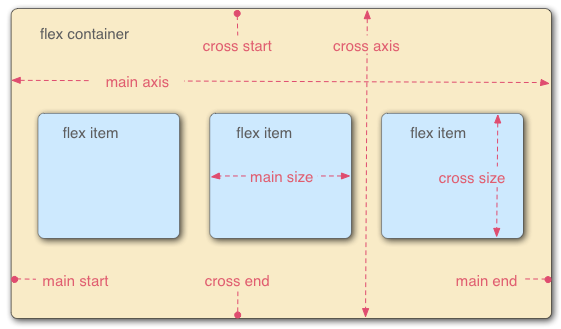

# 弹性盒子
## 为什么是弹性盒子?  
长久以来，CSS 布局中唯一可靠且跨浏览器兼容的创建工具只有 floats 和 positioning。这两个工具大部分情况下都很好使，但是在某些方面它们具有一定的局限性，让人难以完成任务。

以下简单的布局需求是难以或不可能用这样的工具（ floats 和 positioning）方便且灵活的实现的：

在父内容里面垂直居中一个块内容。
使容器的所有子项占用等量的可用宽度/高度，而不管有多少宽度/高度可用。
使多列布局中的所有列采用相同的高度，即使它们包含的内容量不同。
正如你将在后面的章节中看到的一样，弹性盒子使得很多布局任务变得更加容易。让我们继续吧！  
### 指定元素的布局为 flexible
首先，我们需要选择将哪些元素将设置为柔性的盒子。我们需要给这些 flexible 元素的父元素 display 设置一个特定值。在本例中，我们想要设置 <article> 元素，因此我们给 <section>（变成了 flex 容器）设置 display：  
## flex 模型说明  
当元素表现为 flex 框时，它们沿着两个轴来布局：  
  
- 主轴：是沿着flex元素放置的方向延申的轴（比如页面上的横向的行、纵向的列）。该轴的开始和结束被称为 main start 和 main end。  
- 交叉轴（cross axis）是垂直于 flex 元素放置方向的轴。该轴的开始和结束被称为 cross start 和 cross end。  
- 设置了 display: flex 的父元素（在本例中是 <section>）被称之为 flex 容器（flex container）。  
- 在 flex 容器中表现为柔性的盒子的元素被称之为 flex 项（flex item）（本例中是 <article> 元素。
