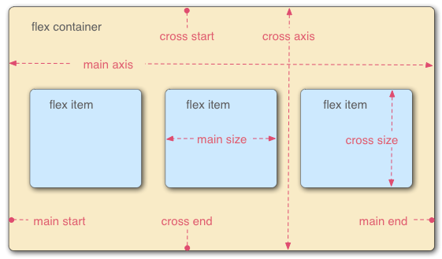

# 弹性盒子
## 为什么是弹性盒子?  
长久以来，CSS 布局中唯一可靠且跨浏览器兼容的创建工具只有 floats 和 positioning。这两个工具大部分情况下都很好使，但是在某些方面它们具有一定的局限性，让人难以完成任务。

以下简单的布局需求是难以或不可能用这样的工具（ floats 和 positioning）方便且灵活的实现的：

在父内容里面垂直居中一个块内容。
使容器的所有子项占用等量的可用宽度/高度，而不管有多少宽度/高度可用。
使多列布局中的所有列采用相同的高度，即使它们包含的内容量不同。
正如你将在后面的章节中看到的一样，弹性盒子使得很多布局任务变得更加容易。让我们继续吧！  
### 指定元素的布局为 flexible
首先，我们需要选择将哪些元素将设置为柔性的盒子。我们需要给这些 flexible 元素的父元素 display 设置一个特定值。在本例中，我们想要设置 <article> 元素，因此我们给 <section>（变成了 flex 容器）设置 display：  
## flex 模型说明  
当元素表现为 flex 框时，它们沿着两个轴来布局：  
  
- 主轴：是沿着flex元素放置的方向延申的轴（比如页面上的横向的行、纵向的列）。该轴的开始和结束被称为 main start 和 main end。  
- 交叉轴（cross axis）是垂直于 flex 元素放置方向的轴。该轴的开始和结束被称为 cross start 和 cross end。  
- 设置了 display: flex 的父元素（在本例中是 <section>）被称之为 flex 容器（flex container）。  
- 在 flex 容器中表现为柔性的盒子的元素被称之为 flex 项（flex item）（本例中是 <article> 元素。
## 列还是行?
弹性盒子提供了 flex-direction 这样一个属性，它可以指定主轴的方向（弹性盒子子类放置的地方）— 它默认值是 row，这使得它们在按你浏览器的默认语言方向排成一排（在英语/中文浏览器中是从左到右）。看index0.html  
## 换行  
看index1.html  
CSS flex-wrap 指定 flex 元素单行显示还是多行显示 。如果允许换行，这个属性允许你控制行的堆叠方向。  
article 元素上设置的 flex: 200px 规则，意味着每个元素的宽度至少是200px；
## flex-flow 缩写
到这里，应当注意到存在着 flex-direction 和 flex-wrap — 的缩写 flex-flow。比如，你可以将
```css
flex-direction: row;
flex-wrap: wrap;
```
替换为
```css
flex-flow: row wrap;
```
## flex: 缩写与全写  
flex 是一个可以指定最多三个不同值的缩写属性：  
- 第一个就是上面所讨论过的无单位比例。可以单独指定全写 flex-grow 属性的值。  
- 第二个无单位比例 — flex-shrink — 一般用于溢出容器的 flex 项。这指定了从每个 flex 项中取出多少溢出量，以阻止它们溢出它们的容器。 这是一个相当高级的弹性盒子功能，我们不会在本文中进一步说明。
- 第三个是上面讨论的最小值。可以单独指定全写 flex-basis 属性的值。  
## 水平和垂直对齐  
align-items 控制 flex 项在交叉轴上的位置。   
- 默认的值是 stretch，其会使所有 flex 项沿着交叉轴的方向拉伸以填充父容器。如果父容器在交叉轴方向上没有固定宽度（即高度），则所有 flex 项将变得与最长的 flex 项一样长（即高度保持一致）。我们的第一个例子在默认情况下得到相等的高度的列的原因。
- 在上面规则中我们使用的 center 值会使这些项保持其原有的高度，但是会在交叉轴居中。这就是那些按钮垂直居中的原因。
- 你也可以设置诸如 flex-start 或 flex-end 这样使 flex 项在交叉轴的开始或结束处对齐所有的值。查看 align-items 了解更多.
  
justify-content 控制 flex 项在主轴上的位置。 
- 默认值是 flex-start，这会使所有 flex 项都位于主轴的开始处。
- 你也可以用 flex-end 来让 flex 项到结尾处。
- center 在 justify-content 里也是可用的，可以让 flex 项在主轴居中。
- 而我们上面用到的值 space-around 是很有用的——它会使所有 flex 项沿着主轴均匀地分布，在任意一端都会留有一点空间。
- 还有一个值是 space-between，它和 space-around 非常相似，只是它不会在两端留下任何空间。
## flex 项排序
```css
button:first-child {
  order: 1;
}
```
- 所有 flex 项默认的 order 值是 0。
- order 值大的 flex 项比 order 值小的在显示顺序中更靠后。
- 相同 order 值的 flex 项按源顺序显示。所以假如你有四个元素，其 order 值分别是2，1，1和0，那么它们的显示顺序就分别是第四，第二，第三，和第一。
- 第三个元素显示在第二个后面是因为它们的 order 值一样，且第三个元素在源顺序中排在第二个后面。
## flex 嵌套


