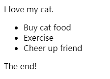

# 介绍css布局
在这个模块中将涉及更多关于页面布局技术的细节：  
- 正常布局流
- display属性
- 弹性盒子
- 网格
- 浮动
- 定位
- CSS 表格布局
- 多列布局  
## 正常布局流(Normal flow)  
正常布局流(normal flow)是指在不对页面进行任何布局控制时，浏览器默认的HTML布局方式。让我们快速地看一个HTML的例子：  
```html
<p>I love my cat.</p>

<ul>
  <li>Buy cat food</li>
  <li>Exercise</li>
  <li>Cheer up friend</li>
</ul>

<p>The end!</p>
```
  
出现在另一个元素下面的元素被描述为**块元素**，与出现在另一个元素旁边的**内联元素**不同，内联元素就像段落中的单个单词一样。  
下列布局技术会覆盖默认的布局行为：  
- display 属性 — 标准的value,比如block, inline 或者 inline-block 元素在正常布局流中的表现形式 (见 Types of CSS boxes). 接着是全新的布局方式，通过设置display的值, 比如 CSS Grid 和 Flexbox.
- 浮动——应用 float 值，诸如 left 能够让块级元素互相并排成一行，而不是一个堆叠在另一个上面。
- position 属性 — 允许你精准设置盒子中的盒子的位置，正常布局流中，默认为 static ，使用其它值会引起元素不同的布局方式，例如将元素固定到浏览器视口的左上角。
- 表格布局— 表格的布局方式可以用在非表格内容上，可以使用display: table和相关属性在非表元素上使用。
- 多列布局— 这个 Multi-column layout 属性 可以让块按列布局，比如报纸的内容就是一列一列排布的。  
## display属性  
在css中实现页面布局的主要方法是设定display属性的值。此属性允许我们更改默认的显示方式。正常流中的所有内容都有一个display的值，用作元素的默认行为方式。例如，英文段落显示在一个段落的下面，这是因为它们的样式是display:block。如果在段落中的某个文本周围创建链接，则该链接将与文本的其余部分保持内联，并且不会打断到新行。这是因为&lt;a>元素默认为display:inline。  
## 弹性盒子(Flexbox)  
Flexbox 是CSS 弹性盒子布局模块（Flexible Box Layout Module）的缩写，它被专门设计出来用于创建横向或是纵向的一维页面布局。要使用flexbox，你只需要在想要进行flex布局的父元素上应用display: flex ，所有直接子元素都将会按照flex进行布局。


