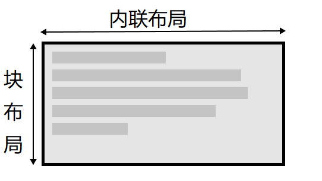

# 处理不同方向的文本
## 什么是书写模式
CSS的书写模式是文本的排列方向是横向还是纵向的。
```css
 writing-mode: vertical-rl;
/*竖着的*/
```
**writing-mode**的三个值分别是：
1. horizontal-tb: 块流向从上至下。对应的文本方向是横向的。  
2. vertical-rl: 块流向从右向左。对应的文本方向是纵向的。  
3. vertical-lr: 块流向从左向右。对应的文本方向是纵向的。
## 书写模式、块级布局和内联布局
如果你使用书写模式的显示是横向的，如英文，那么块在页面上的显示就是从上到下的。  
**块维度指的总是块在页面书写模式下的显示方向。而内联维度指的总是文本方向**
这张图展示了在水平书写模式下的两种维度。  

