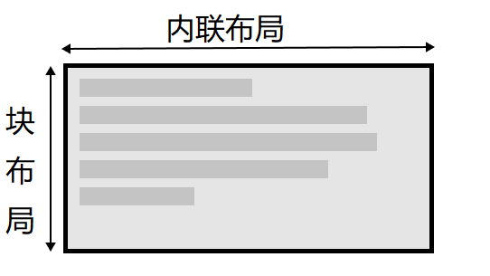
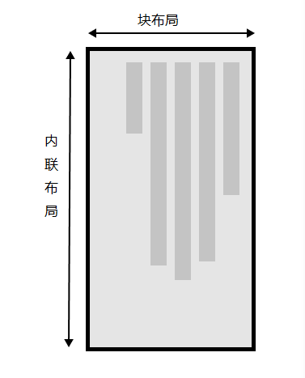

# 处理不同方向的文本
## 什么是书写模式
CSS的书写模式是文本的排列方向是横向还是纵向的。
```css
 writing-mode: vertical-rl;
/*竖着的*/
```
**writing-mode**的三个值分别是：
1. horizontal-tb: 块流向从上至下。对应的文本方向是横向的。  
2. vertical-rl: 块流向从右向左。对应的文本方向是纵向的。  
3. vertical-lr: 块流向从左向右。对应的文本方向是纵向的。
## 书写模式、块级布局和内联布局
如果你使用书写模式的显示是横向的，如英文，那么块在页面上的显示就是从上到下的。  
**块维度指的总是块在页面书写模式下的显示方向。而内联维度指的总是文本方向**
这张图展示了在水平书写模式下的两种维度。  
  
这张图片展示了纵向书写模式下的两种维度。  
  
**块级元素和内联元素**的概念非常重要！！！   
## 逻辑属性和逻辑值
这些属性用逻辑（logical）和相对变化（flow relative）代替了像宽width和高height一样的物理属性  
横向书写模式下，映射到width的属性被称作内联尺寸（inline-size）——内联维度的尺寸。而映射height的属性被称为块级尺寸（block-size），这是块级维度的尺寸。下面的例子展示了替换掉width的inline-size是如何生效的。
### 逻辑外边距、边框和内边距属性  
我们在前面两节中学习了CSS的盒模型和CSS边框。在外边距、边框和内边距属性中，你会发现许多物理属性，例如 margin-top、 padding-left和 border-bottom。就像width和height有映射，这些属性也有相应的映射。  
- margin-top属性的映射是margin-block-start——总是指向块级维度开始处的边距。  
- padding-left属性映射到 padding-inline-start，这是应用到内联开始方向（这是该书写模式文本开始的地方）上的内边距。
- border-bottom属性映射到的是border-block-end，也就是块级维度结尾处的边框。
```html
<!--转换思路一下就好了-->
```
### 逻辑值
...【这里我没看懂，大致知道    float: inline-start;】
### 应该使用物理属性还是逻辑属性呢？
逻辑属性是在物理属性之后出现的，因而最近才开始在浏览器中应用。你可以通过查看MDN的属性页面来了解浏览器对逻辑属性的支持情况。如果你并没有应用多种书写模式，那么现在你可能更倾向于使用物理属性，因为这些在你使用弹性布局和网格布局时非常有用。
